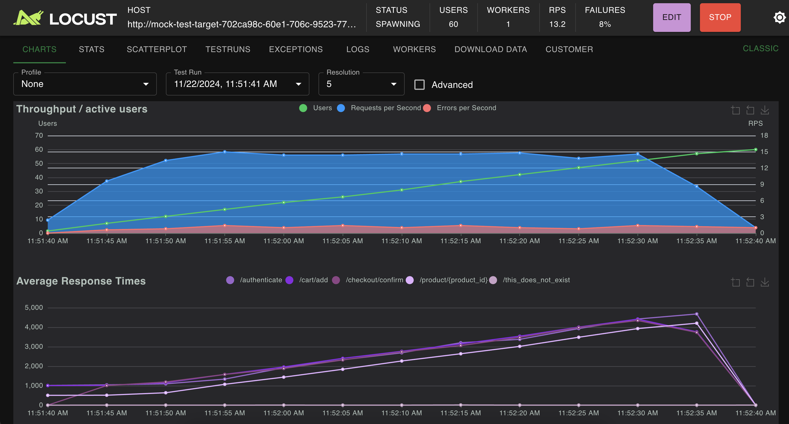

## Installation

```bash
pip install locust-cloud
```

```bash
# in your .bashrc or other login script
export LOCUSTCLOUD_USERNAME='your@email.com'
export LOCUSTCLOUD_PASSWORD='yourpassword'
```

## Notes

* Remember to only direct locust-cloud at sites/services you actually own, or have permission to load test.

## Usage

### List options

```bash
locust-cloud --help
```

### Basic way to run locust-cloud

```bash
locust-cloud -f my_locustfile.py --users 100 # ... other regular locust parameters
```

### Complete example

If you're learning Locust and want to try it out, Locust Cloud has its own demo mock server you can test against, using the locustfile below. Pass `--mock-server` to spawn the mock next to your load generators and point Locust towards it.

```bash
locust-cloud -f my_locustfile.py --users 100 --mock-server
```

```python
from locust import HttpUser, task


class MyUser(HttpUser):
    @task
    def t(self) -> None:
        self.client.post("/authenticate", json={"username": "foo", "password": "bar"})
        for product_id in [1, 2, 42]:
            self.client.get(f"/product/{product_id}", name="/product/{product_id}")
            self.client.post("/cart/add", json={"productId": product_id})
        self.client.post("/checkout/confirm")
        self.client.get("/this_does_not_exist")
```

Your results should be something like this (the mock intentionally has some concurrency issues, so you'll get steadily rising response times as the load increases):



## Extra python packages

If your locustfile needs some additional Python package, you can instruct it to install them by specifying a [requirements.txt](https://pip.pypa.io/en/stable/reference/requirements-file-format/) file:

```bash
locust-cloud -f my_locustfile.py --requirements requirements.txt
```
